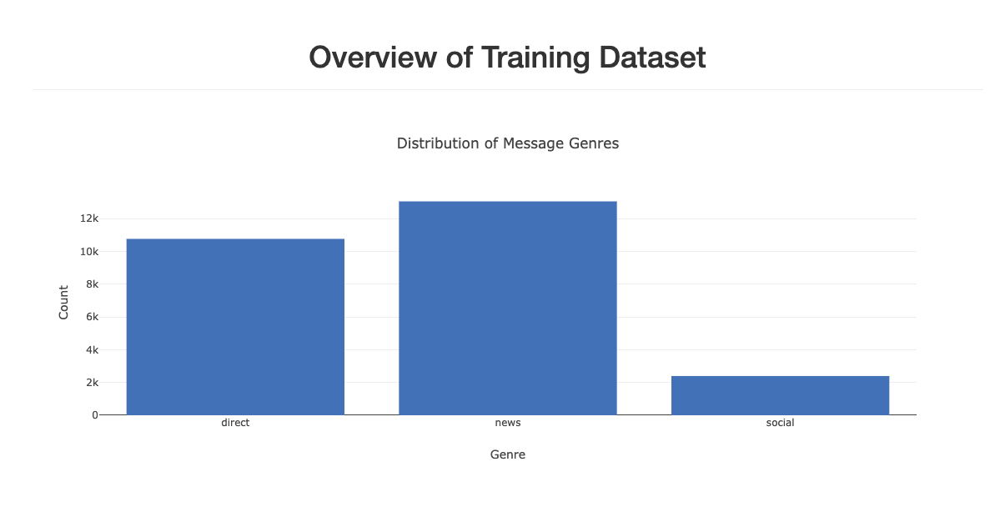
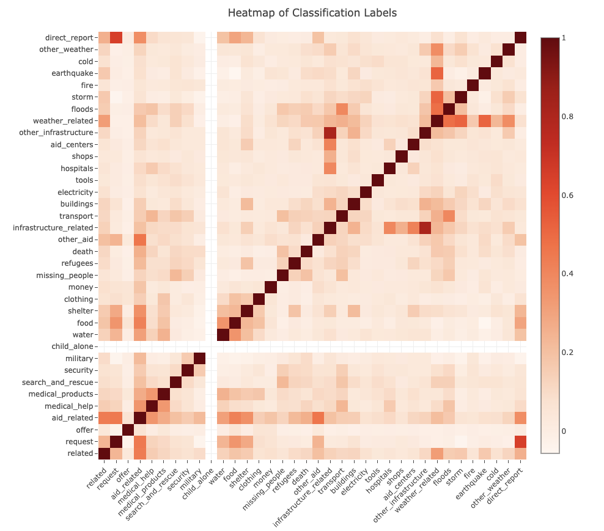

# Disaster Response Project

This project is a part of Udacity's Data Scientist Nanodegree Program in collaboration with Appen, formerly Figure Eight. It aims to build a Natural Language Processing (NLP) tool to categorize disaster-related messages in real-time.

## Table of Contents

1. [Introduction](#introduction)
2. [File Descriptions](#file-descriptions)
3. [Project Setup Instructions](#project-setup-instructions)
4. [Installation](#installation)
5. [Screenshots](#screenshots)
6. [Acknowledgements](#acknowledgements)

## Introduction

The Disaster Response Pipeline Project uses pre-labeled disaster messages to build a model that can classify messages received during disaster events. The goal is to route these messages to the appropriate disaster response agency efficiently.

The project includes:
- **ETL Pipeline**: Extracts and cleans data, then stores it in an SQLite database.
- **ML Pipeline**: Trains a machine learning model to classify messages.
- **Web Application**: Provides a user interface for classifying messages and visualizing data.

## File Descriptions

### Folder: `app`
- **`run.py`**: Python script to launch the Flask web application.
- **`templates/`**: Contains HTML templates (`go.html` and `master.html`) for the web application.

### Folder: `data`
- **`disaster_messages.csv`**: Messages sent during disaster events (provided by Figure Eight).
- **`disaster_categories.csv`**: Categories associated with the messages.
- **`process_data.py`**: ETL script to clean and store data in a SQLite database.
- **`DisasterResponse.db`**: SQLite database containing cleaned data.
- **`ETL Pipeline Preparation.ipynb`**: Jupyter Notebook for the cleaning and preparing data for machine learning.

### Folder: `models`
- **`train_classifier.py`**: ML pipeline script to train and save the classification model.
- **`classifier.pkl`**: Pickle file containing the trained model.
- **`ML Pipeline Preparation.ipynb`**: Jupyter Notebook for understanding and tuning the ML pipeline.

## Project Setup Instructions

1. Run the following commands in the project's root directory to set up your database and model.

   - To run the ETL pipeline that cleans data and stores it in the database:

     ```bash
     python data/process_data.py data/disaster_messages.csv data/disaster_categories.csv data/DisasterResponse.db
     ```

   - To run the ML pipeline that trains the classifier and saves it:

     ```bash
     python models/train_classifier.py data/DisasterResponse.db models/classifier.pkl
     ```

2. Run the following command in the app's directory to start your web app:

   ```bash
   python run.py
   ```

3. Pull up your browswer and go to:
    ```
    http://0.0.0.0:3000/
    ```


## Installation

Ensure you have Python 3.5 or higher.

Ensure the following Python libraries are installed for the project to function properly:

### Data Handling & Processing:
- `pandas`
- `numpy`
- `sqlalchemy`
- `sqlite3`
- `re` (built-in)

### Machine Learning:
- `scikit-learn` (`sklearn`)
- `xgboost`
- `gensim`

### Natural Language Processing (NLP):
- `nltk`


Ensure required NLTK data is downloaded:
```bash
nltk.download(['punkt', 'wordnet', 'averaged_perceptron_tagger'])
nltk.download('wordnet')
```


## Screenshots 

This is a series of screenshots that illustrate the running of the program.

process_data.py


train_classifier.py


Results for train_classifier.py


Results of run.py


Heading of the web app


First graph of the Distribution of Message Genres


Second graph of Genre vs. Classification Count


Third graph of a Heatmap of Classification Labels



## Acknowledgments

I would like to extend my gratitude to the following organizations:

- **Udacity**: For providing valuable learning resources and support throughout the development of this project.
- **Appen, formerly Figure Eight**: For their contributions to the dataset and data labeling services that were essential for the project.

Thank you for your support and resources.